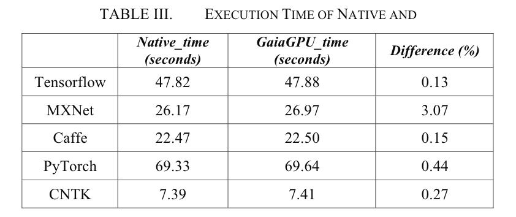
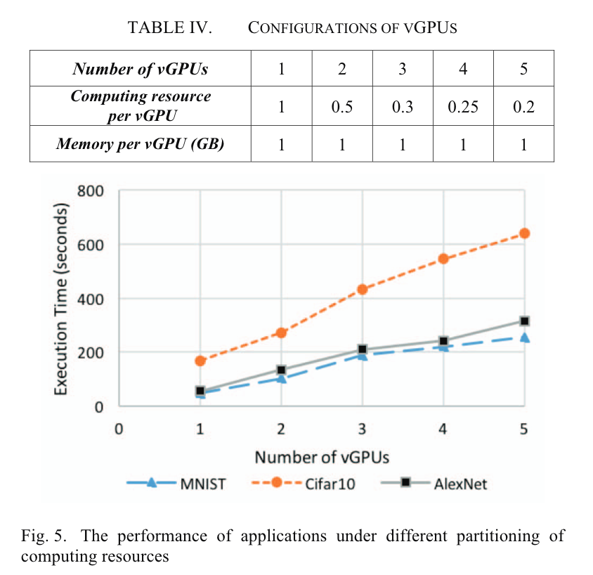
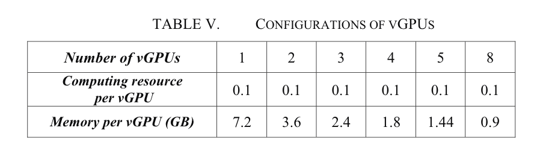
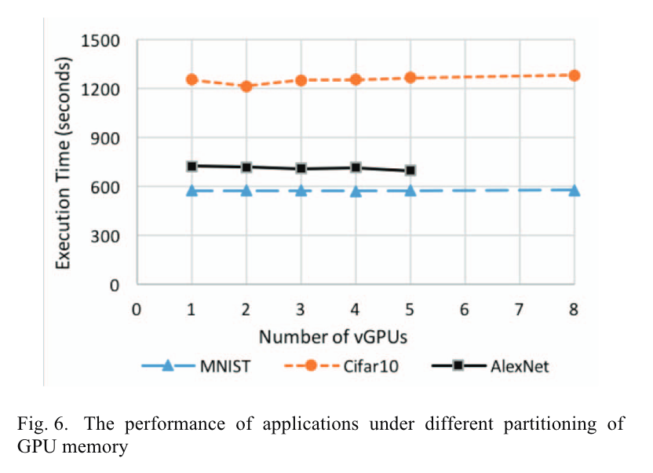

# GaiaGPU - Reading Report

> 原文：GaiaGPU: Sharing GPUs in Container Clouds(ISPA'18) https://ieeexplore.ieee.org/abstract/document/8672318
>
> > 注意：《vCUDA: GPU accelerated high performance computing in virtual machines》(IPDPS'09，TC'12，应该是先发了conference后来又发了journal)和本项目重名，但不是同一个东西。
>
> 
>
> 开源链接：https://github.com/tkestack/vcuda-controller
>
> 腾讯云论坛GaiaStack介绍：https://cloud.tencent.com/developer/article/1389547
>
> 腾讯云市场GaiaStack：https://market.cloud.tencent.com/products/3966?productId=3966#

[TOC]

## Goal

在容器之间共享GPU memory和GPU计算资源（线程/SM）

## Design

At the host level, the GPU Manager is in charge of creating vGPUs, and the GPU Scheduler is responsible for allocating physical GPU resources to vGPUs. At the container level, the vGPU Library component takes charge of managing GPU resources of a specific container.

### GPU Manager

advertise GPUs to the Kubelet.

- Rigister: GPU manager inform the Kubelet of its existence
- ListAndWatch: GPU Manager returns a list of devices it manages to the Kubelet. (Memory: 256MB as a unit (vmemory device); Computing resources: partition a physical GPU into 100 vprocessor devices.)
- Allocate: When a user requires GPU devices in a container specification, the Kubelet arbitrarily selects the corresponding amount of devices. (need to map the virtual devices to physical ones.)

### GPU Scheduler

allocates GPUs based on topology

### vGPU Manager

Following receiving the container's configuration, it creates an unique directory for the container on the host. The directory is named after the container name and is included in the allocateResponse.

It also maintains a list of containers which are alive and are assigned with GPUs and periodically checks if these containers are still alive.

### vGPU Library

The vGPU Library running in the container is used to manage the GPU resources of its deployed container. The vGPU Library will be launched when the first GPU application is executed in the container.

It intercepts the memory-related APIs and the computing-related APIs in the CUDA Library by the *LD_LIBRARY_PATH* mechanism.

>LD_LIBRARY_PATH is an environment variable for Linux systems that affects the runtime link of programs, which allows some directories to be loaded before the standard set of directories. TABLE I. shows the all intercepted CUDA APIs.
>
>LD_LIBRARY_PATH是Linux系统下的环境变量名，类似于Path(设置可执行文件的搜索路径)。
>
>用于指定查找共享库（动态链接库）时除了默认路径（./lib和./usr/lib）之外的其他路径。

### Resources Limits

For memory resources, the hard limit is adopted. 

The elastic limit is leveraged for computing resources because they have a great impact on application performance.

### Elastic Resource Allocation

for computing resources. 暂时更改资源分配。

如果物理GPU有空闲资源，即使容器的资源请求已经超出其配额，vGPU Library也会继续给容器分配计算资源。如果没有剩余的空闲资源，并且容器的消耗的资源大于其配额，vGPU Library会逐渐收回超额（over-allocated）资源。

### Dynamic Resource Allocation

for memomy and computing resources. 永久更改资源分配。

在容器运行过程中可以修改容器的资源分配。

## Experiments

All experiments are deployed on Tencent container cloud **GaiaStack** which uses **Kubernetes version 1.9** as the container orchestrator.

### Overhead

5 popular deep learning frameworks for evaluation: Tensorflow, MXNet, Caffe, PyTorch, CNTK.

Run the **MNIST** application on five deep learning frameworks in both the host and the container, and measure its execution time.

结论：额外开销小。

### GPU partitioning

partition a physical GPU into 1, 2, 3, 4, 5, and 8 vGPUs and assigns each vGPU to a container.

run 3 GPU applications (MNIST, Cifar10, AlexNet) (both computing intensive and memory intensive) in each container and measure their execution time. Tensorflow framework is used to run these applications.

- 实验1: 评估partition计算资源 对软件性能的影响

  

- 实验2: 评估partition内存资源 对软件性能的影响

  

  

### Isolation

launch 2, 4, and 8 containers on a physical GPU and measure the memory utilization and GPU utilization of containers.

The GPU workload is the MNIST application using Tensorflow framework.

结论：在多个容器之间共享GPU时，可以有效地隔离每个容器的GPU资源。

### Elastic Resource Allocation

做了一个实验，证明成功实现了Elastic Resource Allocation。

## Reflection

感觉这篇文章对实现细节讲得很少

比如文中的例子，任务A有0.3GPU的资源，后来又获得了一些资源，这些新allocate的线程要做什么任务？如何协作？以及这是那个层次实现的？

KubeShare对这篇文章的评价：

> 但上述解决方案都没有将gpu视为一流资源或提供局部感知调度来缓解性能干扰问题。此外，它们都是作为调度扩展器实现的，而不是Kubernetes中的自定义控制器。因此，他们的目标是替换或扩展现有的kube-scheduler机制，而我们更喜欢KubeShare与本机kube-scheduler共存和协作，以获得更好的灵活性和能力。（机翻）

不过我觉得KubeShare对GaiaGPU并没有深入了解。首先KubeShare的文章里连Gaia的名字都写错了，而且还说Gaia是在Aliyun的基础上做的（其实是在Tencent GaiaStack上）。