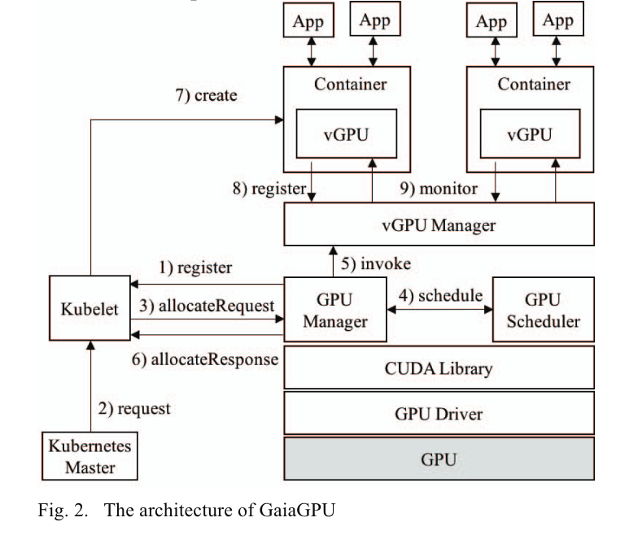

> 2023.8.29
>
> k8s封装GPU，Pod资源调度管理
>
> cuda 国产硬件库函数 编译 cuda工作原理 层次
>
> arm生态 -> riscv生态，自动化迁移

[TOC]

## CUDA工作原理

Nvidia GPU的软件调用栈：

ML程序 -> TensorFlow/PyTorch/paddle等框架 -> Cuda Runtime及周边生态（cudart、cublas、cudnn、cufft、cusparse等） -> Cuda driver (User Mode Driver) -> Nvidia driver (Kernel Mode Driver) -> Nvidia GPU

CUDA开发者使用的，通常是CUDA Runtime API（high-level），而CUDA Driver API是low-level的，对程序和GPU硬件有更精细的控制。Runtime API是对Driver API的封装。

CUDA Driver即为UMD（User Mode Driver，GPU用户态驱动程序），他直接和KMD（Kernel Mode Driver，GPU内核态驱动程序）打交道。两者都属于Nvidia Driver Package。英伟达软件生态封闭：无论是 nvidia.ko，还是 libcuda.so，还是 libcudart，都是被剥离了符号表的。大多数函数名是加密替换了的。其它的反调试、反逆向手段也基本不可用。（nvidia实习生实现了cuda driver逆向工程。只你想了一小部分umd和kmd之间的接口，已不维护）

## GPU共享

为了实现GPU共享，我们需要解决的问题：

- 算力隔离：限制任务占据算力（线程/SM）及显存的比例，进一步地，可以限制总线带宽

- 故障隔离：限制一个任务产生故障后的影响范围

- 并行模式：时间片模式和MPS模式

GPU池化：使用远程访问的形式使用GPU资源，任务是用本机的CPU和另一台机器的GPU，两者通过网络进行通信。

## 容器GPU虚拟化

常见的Nvidia GPU虚拟化技术方案有：Nvidia GRID (vGPU)，Nvidia MPS，cGPU和vCUDA。其中，在k8s容器上常用的为cGPU（阿里，未开源）和vCUDA（腾讯，开源）。

NVidia（均未开源）：

- Nvidia GRID (vGPU)共享模块在Nvidia driver中（未开源、有加密、无法逆向）。只能用于虚拟机平台，不能用于docker容器。无法动态调整资源分配比例（只能所有用户平分）。
- Nvidia MPS，部分文档公开。在算力隔离方面表现良好（将多个进程的cuda context合并到一个context中，在context内部实现算力隔离，省去context switch的开销）。但会导致额外的故障传播（某一个server或client出错，会导致其他无关client异常退出），因此在工业界很少使用。

kubernetes：

- 阿里 cGPU，未开源。支持容器级GPU虚拟化，多个容器共享GPU。但只能在阿里云使用。

- **腾讯TKE等 vCUDA，开源**。设计只侵入了cuda层，用户程序无需重新编译就可以运行在基于vcuda的gpu上。vcuda修改了计算操作、显存操作、信息获取这3个方面的API。

  > 原文：《GaiaGPU: Sharing GPUs in Container Clouds》(ISPA'18)
  >
  > 开源链接：https://github.com/tkestack/vcuda-controller
  >
  > > 注意：《vCUDA: GPU accelerated high performance computing in virtual machines》(IPDPS'09，TC'12，应该是先发了conference后来又发了journal)和本项目重名，但不是同一个东西。

  目的：在容器之间共享GPU存储和GPU计算资源（线程/SM）

  At the host level, the GPU Manager is in charge of creating vGPUs, and the GPU Scheduler is responsible for allocating physical GPU resources to vGPUs. At the container level, the vGPU Library component takes charge of managing GPU resources of a specific container.

  

  GPU Manager: advertise GPUs to the Kubelet.

  

  - Rigister: GPU manager inform the Kubelet of its existence
  - ListAndWatch: GPU Manager returns a list of devices it manages to the Kubelet. (Memory: 256MB as a unit (vmemory device); Computing resources: partition a physical GPU into 100 vprocessor devices.)
  - Allocate: When a user requires GPU devices in a container specification, the Kubelet arbitrarily selects the corresponding amount of devices. (need to map the virtual devices to physical ones.)

- Nvidia Docker

  可以在docker内使用GPU，可以装一部分用户态的驱动程序。但只能给容器分配一整个GPU，无法share。

- ConvGPU

  在容器内share GPU memory，但不分享算力资源（线程）。

  > only supports sharing of memory resources and only virtualizes a single GPU

- 

  

- Gandiva

  https://zhuanlan.zhihu.com/p/347789271

- 

- GPU池化：

- fungible

- bitfusion

- rcuda

  http://www.rcuda.net

- Orionx

- GPU热迁移

> A survey of GPU sharing for DL: https://zhuanlan.zhihu.com/p/285994980
>
> GPU虚拟化，算力隔离，和qGPU: https://cloud.tencent.com/developer/article/1831090