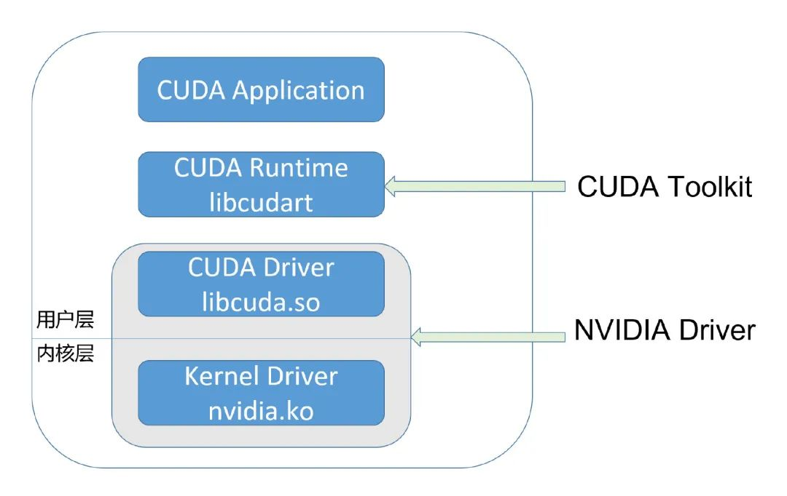

[TOC]

# CUDA和k8s基本原理

## CUDA原理

Nvidia GPU的软件调用栈：

ML程序 -> TensorFlow/PyTorch/paddle等框架 -> Cuda Runtime及周边生态（cudart、cublas、cudnn、cufft、cusparse等） -> Cuda driver (User Mode Driver) -> Nvidia driver (Kernel Mode Driver) -> Nvidia GPU

CUDA开发者使用的，通常是CUDA Runtime API（high-level），而CUDA Driver API是low-level的，对程序和GPU硬件有更精细的控制。Runtime API是对Driver API的封装。

CUDA Driver即为UMD（User Mode Driver，GPU用户态驱动程序），他直接和KMD（Kernel Mode Driver，GPU内核态驱动程序）打交道。两者都属于Nvidia Driver Package。英伟达软件生态封闭：无论是 nvidia.ko，还是 libcuda.so，还是 libcudart，都是被剥离了符号表的。大多数函数名是加密替换了的。其它的反调试、反逆向手段也基本不可用。（nvidia实习生实现了cuda driver逆向工程。只你想了一小部分umd和kmd之间的接口，已不维护）

## k8s原理

docker镜像，容器，仓库

docker镜像：一个特殊的文件系统，提供容器运行时需要的程序、库、资源、配置等文件，还包括一些为运行时准备的配置参数（如环境变量）。不包含任何动态数据。

docker registry：负责管理docker镜像。官方docker hub中有大量高质量官方镜像。

docker用于具体业务的困难：编排、管理、调度困难

kubernetes集群：包括一个master（主结点，负责管理和控制）和很多node（计算结点，执行具体任务）

master结点：

- API Server：整个系统对外的接口，供客户端和其他组件调用
- Scheduler：对集群内部资源的调度，按照调度策略将pod调度到相应的机器上
- Controller Manager：资源的自动化控制中心，维护和管理集群的状态，如故障检测、自动扩展等
- etcd：保存整个集群的状态

node结点：

- pod：k8s中最基本的操作单元，每个pod代表集群中运行的一个进程，内部封装了一个或多个紧密相关的容器
- docker：用来创建容器
- kubelet：负责pod对应容器的创建、启停等任务，同时和master结点协作完成集群管理
- kube-proxy：为pod对象提供代理
- fluentd：日志收集、存储和查询

# GPU + container

## GPU共享

为了实现GPU共享，我们需要解决的问题：

- 算力隔离：限制任务占据算力（线程/SM）及显存的比例，进一步地，可以限制总线带宽

- 故障隔离：限制一个任务产生故障后的影响范围

- 并行模式：时间片模式和MPS模式

GPU池化：使用远程访问的形式使用GPU资源，任务是用本机的CPU和另一台机器的GPU，两者通过网络进行通信。

## 容器 + GPU

### NVidia（均未开源）

- Nvidia GRID (vGPU)共享模块在Nvidia driver中（未开源、有加密、无法逆向）。只能用于虚拟机平台，不能用于docker容器。无法动态调整资源分配比例（只能所有用户平分）。
- Nvidia MPS，部分文档公开。在算力隔离方面表现良好（将多个进程的cuda context合并到一个context中，在context内部实现算力隔离，省去context switch的开销）。但会导致额外的故障传播（某一个server或client出错，会导致其他无关client异常退出），因此在工业界很少使用。

### kubernetes

> [【Kubernetes】如何让kubernetes集群使用GPU](https://tweakzx.github.io/p/kubernetes%E5%A6%82%E4%BD%95%E8%AE%A9kubernetes%E9%9B%86%E7%BE%A4%E4%BD%BF%E7%94%A8gpu/)

- 阿里 cGPU，未开源无论文。

  > https://www.alibabacloud.com/help/zh/elastic-gpu-service/latest/use-docker-to-install-and-use-cgpu

  支持容器级GPU虚拟化，多个容器共享GPU。但只能在阿里云使用。

  其共享模块在Nvidia driver层之上，也就是内核态。由于是在公有云使用，相对于用户态的共享会更加安全。

  cGPU实现了一个内核模块cgpu_km，该模块可以对一个物理GPU虚拟出16个虚拟GPU设备。在容器挂载设备时，修改后的container runtime将挂载虚拟GPU设备，而不是真实GPU设备。通过这种方式实现了GPU劫持。当用户程序的请求下发至内核模块cgpu_km时，模块通过修改请求及回复来限制GPU显存资源。

  内核模块也实现了简单的算力调度，通过限制每个容器可下发kernel的时间片来隔离算力资源（但不清楚使用何种方式精准地控制上下文切换的时间）。可以提供公平/抢占/权重三种算力分配模式。值得注意的是，cGPU目前不能中止已经发送到GPU上的请求，因此如追求算力隔离，需要延长时间片的长度，会造成一定的算力浪费。

  

  虽然没有完全开源，但公开了可在k8s上使用的调度器和device-plugin，可以在k8s系统上作为扩展使用。

  > scheduler: https://github.com/AliyunContainerService/gpushare-scheduler-extender
  >
  > device plugin: https://github.com/AliyunContainerService/gpushare-device-plugin

- 腾讯TKE等 GaiaGPU/vCUDA，开源。

  > GaiaGPU: Sharing GPUs in Container Clouds (ISPA'18) https://ieeexplore.ieee.org/abstract/document/8672318
  >
  > 开源链接：https://github.com/tkestack/vcuda-controller
  >
  > 腾讯云论坛GaiaStack介绍：https://cloud.tencent.com/developer/article/1389547
  >
  > 腾讯云市场GaiaStack：https://market.cloud.tencent.com/products/3966?productId=3966#
  >
  > [【Kubernetes】部署gaiaGPU（vCUDA）](https://tweakzx.github.io/p/kubernetes部署gaiagpuvcuda/)

  通过劫持对Cuda driver API的调用来做到资源隔离。劫持的调用如图二所示。具体实现方式也较为直接，在调用相应API时检查：（1）对于显存，一旦该任务申请显存后占用的显存大小大于config中的设置，就报错。（2）对于计算资源，存在硬隔离和软隔离两种方式，共同点是当任务使用的GPU SM利用率超出资源上限，则暂缓下发API调用。不同点是如果有资源空闲，软隔离允许任务超过设置，动态计算资源上限。而硬隔离则不允许超出设置量。

- 腾讯qGPU，未开源

  > https://cloud.tencent.com/document/product/560/66232

  腾讯在内核劫持类GPU共享方向上，依托腾讯云容器服务 TKE 对外开源的 [Elastic GPU](https://github.com/elastic-ai/elastic-gpu) 框架，推出了资源隔离方案qGPU（QoS GPU），支持多容器共享 GPU 与多容器跨 GPU 资源分配。

  值得注意的是，qGPU效仿Nvidia vGPU在必要时context switch，实现了强算力隔离，尽量保证同时使用GPU的业务之间性能与资源不受干扰。

- KubeShare，开源。

  > KubeShare: A Framework to Manage GPUs as First-Class and Shared Resources in Container Cloud (HPDC'20)
  >
  > code: https://github.com/NTHU-LSALAB/KubeShare

  在资源隔离方面和Gaia的方法类似，也是通过拦截转发的方式。

- Nvidia Docker

  可以在docker内使用GPU，可以装一部分用户态的驱动程序。但只能给容器分配一整个GPU，无法share。

- rCUDA，未开源

  > rCUDA: Reducing the Number of GPU-Based Accelerators in High Performance Clusters (HPCS'10)
  >
  > http://www.rcuda.net

  和Gaia一样，在Cuda driver API之上，通过劫持调用来做资源隔离。不同的是，rCuda除了资源隔离，最主要的目标是支持池化。池化简单来讲就是使用远程访问的形式使用GPU资源，任务使用本机的CPU和另一台机器的GPU，两者通过网络进行通信。也是因为这个原因，共享模块需要将CPU和GPU的调用分开。然而正常情况下混合编译的程序会插入一些没有开源的Cuda API，因此需要使用作者提供的cuda，分别编译程序的CPU和GPU部分。如果使用该产品，用户需要重新编译，对用户有一定的影响。

- Gandiva，未开源

  > Gandiva: Introspective Cluster Scheduling for Deep Learning (OSDI ’18)
  >
  > slide: https://www.usenix.org/sites/default/files/conference/protected-files/osdi18_slides_sivathanu.pdf

  从深度学习训练任务的特点入手：Feedback-driven exploration（反馈驱动的搜索），Heterogeneity（异构性），Intra-job predictability（作业内的可预测性）。作者利用特征3来解决由特征1.2导致的GPU利用率低的问题。

  

  调度机制：Suspend-Resume（类似轮流运行），Packing（类似任务并行），Migration（任务迁移到另一个GPU上），Grow-Shrink（存在空闲时给任务分配空余GPU）。
  
  性能衡量：Profiling（过比对每个迭代过程所花费的时间，trial-and-error，而不是建模计算）。
  
- AntMan

  > AntMan: Dynamic Scaling on GPU Clusters for Deep Learning(OSDI'20) https://www.usenix.org/system/files/osdi20-xiao.pdf
  >
  > slide: https://www.usenix.org/sites/default/files/conference/protected-files/osdi20_slides_xiao.pdf

  

### 其他

- SIREN 

  > Distributed Machine Learning with a Serverless Architecture (INFOCOM'19) 
  >
  > This work is supported by a research contract with Huawei Corp. and an NSERC Collaborative Research and Development (CRD) grant. 所以可能不会开源

  是基于serverless function而不是k8s。但感觉思路可以借鉴。

  一个基于无服务器架构设计的分布式机器学习框架。由两部分组成：本地客户端和无服务器云平台（AWS Lambda）。本地客户端使用深度强化学习agent进行资源调度决策，云平台根据决策结果为ML训练任务加载无状态函数。
  
  
  
  工作流程：
  
  本地上传一个代码包（code package，包含用户定义的ML模型和依赖的库函数）到云平台
  
  step1.scheduler根据初始化资源方案加载无状态函数集群
  
  step2.进行基于SGD的第一个epoch的训练
  
  step3.收集作业的函数状态数据，并返回给本地客户端
  
  step4.函数状态发送给深度强化学习agent（DRL Agent，已经经过训练）
  
  step5.DRL agent为下一个epoch做出资源调度决策，并发送给scheduler
  
  特点：每个epoch都会用agent进行一次决策。所以在不同epoch中可以启动不同数量、不同内存配置的函数。解决了ML工作流中不同任务异构性导致的资源不平衡问题。ML用户往往会根据整个工作流中需要最大算力的时刻进行资源分配，导致GPU利用率降低。
  
  > Heterogeneity (异质性、异构性)。训练任务在运行过程中，例如前向传播、反向求导、梯度更新等阶段对 GPU 资源的需求是不同的。batch 与 batch 之间 GPU 资源往往是空闲的。资源使用情况在任务进行的全程是不一致的，但这没有被充分的挖掘和利用。

## GPU migration

把一个（执行中？）任务从一个GPU迁移到另一个GPU上

应用场景：在任务执行过程中，某个GPU由于某些原因发生overwhelmed的情况。此时不想直接杀死运行中的任务，而想把其中一至多个任务迁移到另一个GPU上。

[TODO]后续可以调研一下

DCUDA: Dynamic GPU Scheduling with Live Migration Support (SoCC '19)

Gandiva

GPU-Job Migration: The rCUDA Case (TPDS'19)
